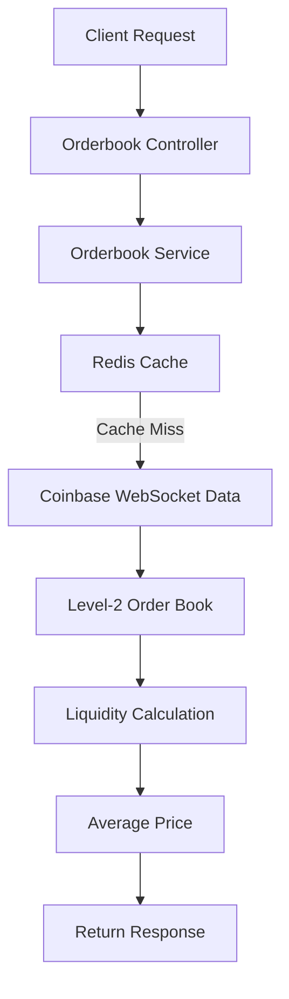
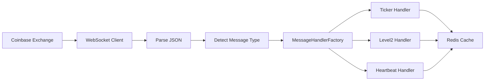
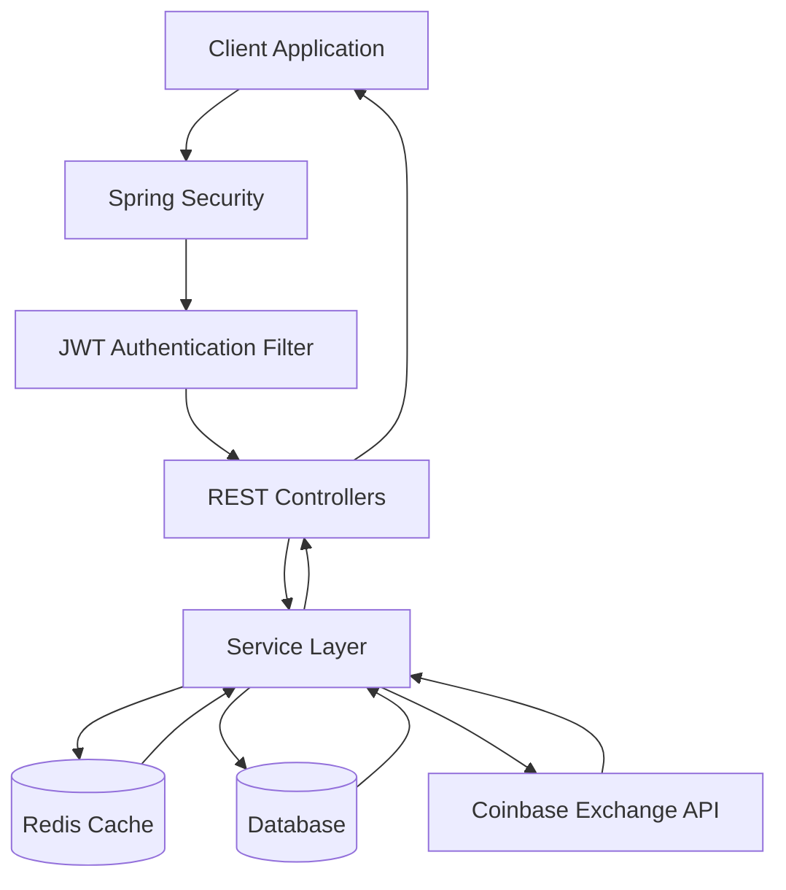
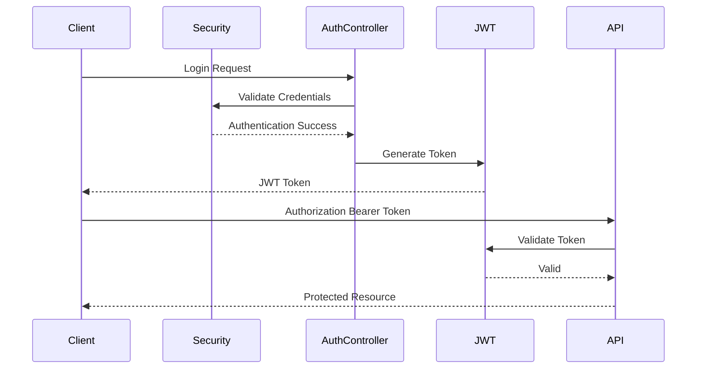

# ExchangeAPIv1

> A production-ready cryptocurrency exchange backend built with Spring Boot, Redis, JWT Authentication, OAuth2, Docker and external exchange integrations.


---

## 📖 Overview

ExchangeAPIv1 is a backend application that provides a secure and scalable infrastructure for cryptocurrency trading platforms.

The project offers authentication, account management, order book retrieval, currency conversion, fee calculation, and integration with external cryptocurrency exchanges while leveraging Redis for caching and Docker for deployment.

The architecture follows common Spring Boot design principles by separating responsibilities into controllers, services, repositories, DTOs, entities, security, and configuration layers.

---

## ✨ Features

- JWT Authentication
- OAuth2 Login Support
- Redis Cache Integration
- Redis Sentinel Support
- Docker & Docker Compose
- RESTful API
- External Exchange Integration
- Order Book API
- Currency Conversion API
- Fee Management
- Spring Security
- Validation
- Exception Handling
- Layered Architecture

---

# 🏛️ Project Architecture

The project follows a layered architecture to ensure maintainability and scalability.

```
                Client
                   │
            REST Controllers
                   │
              Service Layer
                   │
      Repository / External APIs
          │                  │
      PostgreSQL         Coinbase API
                   │
                Redis Cache
```

---

## 📂 Project Structure

```
src
├── config
├── controller
├── dto
├── entity
├── exception
├── mapper
├── repository
├── security
├── service
├── util
└── ExchangeApiApplication.java
```

### Package Responsibilities

| Package | Description |
|----------|-------------|
| config | Spring configuration classes |
| controller | REST API endpoints |
| dto | Request & Response models |
| entity | Database entities |
| exception | Global exception handling |
| mapper | Entity ↔ DTO mapping |
| repository | JPA repositories |
| security | JWT & OAuth2 configuration |
| service | Business logic |
| util | Utility classes |

---

# 🛠️ Core Services

ExchangeAPIv1 is composed of several independent modules, each responsible for a specific business domain.

---

### 🔐 Authentication Service

**Base Path**

```
/api/v1/auth
```

Responsible for:

- User authentication
- JWT token generation
- OAuth2 authentication
- Access token validation
- Secure login flow

**Technologies**

- Spring Security
- JWT
- OAuth2
- BCrypt Password Encoder

---

### 👤 Account Service

**Base Path**

```
/api/v1/accounts
```

Responsible for:

- Account information
- User profile management
- Account retrieval
- User-related business operations

---

### 💱 Currency Conversion Service

**Base Path**

```
/api/v1/conversion
```

Responsible for:

- Cryptocurrency conversion
- Fiat currency conversion
- Exchange rate calculation
- External exchange communication

---

### 📚 Order Book Service

**Base Path**

```
/api/v1/orderbook
```

Responsible for:

- Current market depth
- Bid/Ask information
- Order book retrieval
- Redis caching for fast responses

---

### 💰 Fee Management Service

**Base Path**

```
/api/v1/fees
```

Responsible for:

- Trading fee calculation
- Exchange commission rates
- Fee information
- Trading cost estimation

---

# 🔒 Security

ExchangeAPIv1 uses Spring Security together with JWT Authentication to secure protected resources.

Authentication flow:

```
Client
    │
    │ Login Request
    ▼
Authentication Controller
    │
    ▼
Authentication Manager
    │
    ▼
JWT Token Generated
    │
    ▼
Client Stores Token
    │
    ▼
Authorization: Bearer <token>
    │
    ▼
Protected Endpoints
```

### Security Features

- JWT Authentication
- Stateless Sessions
- OAuth2 Login
- Password Encryption (BCrypt)
- Request Authorization
- Role-Based Access Control (RBAC)
- Authentication Filters
- Global Exception Handling

---

# ⚡ Redis Integration

Redis is used to improve application performance by caching frequently requested market data.

Current usages include:

- Order Book Cache
- Market Data Cache
- Temporary Exchange Responses
- Reduced External API Calls

Benefits:

- Faster API responses
- Lower latency
- Reduced load on external exchanges
- Better scalability

---

# 🐳 Docker Support

The project provides Docker support for easier deployment.

Services include:

- Application Container
- Redis
- Redis Sentinel
- PostgreSQL (if configured)

This allows the entire backend to be started with Docker Compose in a single command.

# 📡 API Documentation

All endpoints are exposed through REST APIs and return JSON responses.

Base URL:

```http
http://localhost:8080/api/v1
```

---

# 🔐 Authentication API

Authentication endpoints are responsible for login, registration and token management.

## Login

```http
POST /auth/login
```

### Request

```json
{
  "email": "user@example.com",
  "password": "password123"
}
```

### Response

```json
{
  "token": "eyJhbGciOiJIUzI1NiJ9...",
  "expiresIn": 3600
}
```

### Possible Responses

| Status | Description |
|----------|-------------|
| 200 | Login successful |
| 401 | Invalid credentials |
| 403 | Access denied |

---

## OAuth2 Login

```http
GET /oauth2/authorization/{provider}
```

Supported providers may include:

- Google
- GitHub
- Other configured providers

### Example

```http
GET /oauth2/authorization/google
```

---

## 👤 Account Service

**Base Path**

```http
/api/account
```

The Account Service manages user wallets and balances. All endpoints require JWT authentication and operate on the authenticated user's accounts.

| Method | Endpoint | Description |
|---------|----------|-------------|
| GET | `/wallets` | Get all user wallets |
| GET | `/wallets/thirdPart` | Get wallets from third-party exchange (Binance) |
| GET | `/wallet/{asset}` | Get wallet information for a specific asset |
| GET | `/balance` | Get available balance of an asset |
| POST | `/create` | Create a new wallet |
| POST | `/deposit/{description}` | Deposit funds into a wallet |

---

### Get User Wallets

```http
GET /api/account/wallets
```

Returns all wallets belonging to the authenticated user.

**Response**

```json
[
  {
    "asset": "BTC",
    "balance": 0.45,
    "available": 0.42
  },
  {
    "asset": "USDT",
    "balance": 5200.50,
    "available": 5200.50
  }
]
```

---

### Get Third-Party Wallets

```http
GET /api/account/wallets/thirdPart
```

Returns wallet balances retrieved from the connected Binance account.

---

### Get Wallet

```http
GET /api/account/wallet/{asset}
```

Example

```http
GET /api/account/wallet/BTC
```

Returns detailed wallet information for the specified asset.

---

### Get Balance

```http
GET /api/account/balance?asset=BTC
```

Returns only the available balance.

Example response

```json
0.53425
```

---

### Create Wallet

```http
POST /api/account/create?asset=ETH
```

Creates a wallet for the specified asset if it does not already exist.

---

### Deposit

```http
POST /api/account/deposit/{description}
```

Parameters

| Parameter | Type |
|------------|------|
| asset | String |
| amount | BigDecimal |
| description | String |

Example

```http
POST /api/account/deposit/Salary?asset=USDT&amount=1000&description=Salary
```

Response

```json
{
  "asset": "USDT",
  "balance": 6200.50
}
```

## 💱 Conversion Service

**Base Path**

```http
/api/conversions
```

The Conversion Service allows users to create cryptocurrency conversion offers, execute conversions, cancel pending offers, and retrieve conversion details.

All endpoints require JWT authentication.

| Method | Endpoint | Description |
|---------|----------|-------------|
| POST | `/` | Create a new conversion offer |
| POST | `/{id}/accept` | Accept and execute a conversion |
| POST | `/{id}/cancel` | Cancel an existing conversion |
| GET | `/{id}` | Get conversion details |

---

### Create Conversion Offer

```http
POST /api/conversions
```

Creates a new conversion quotation between two assets.

### Request Parameters

| Parameter | Type | Description |
|------------|------|-------------|
| fromAsset | String | Source asset |
| toAsset | String | Target asset |
| amount | BigDecimal | Amount to convert |
| description | String | Conversion description |
| side | String | BUY or SELL |
| conversionType | String | Conversion type |
| idempotencyId | String | Unique request identifier |

### Example Request

```http
POST /api/conversions?fromAsset=BTC&toAsset=USDT&amount=0.5&description=Convert BTC&side=SELL&conversionType=MARKET&idempotencyId=8c5c76fa
```

### Response

```json
{
  "id": "conv_001",
  "fromAsset": "BTC",
  "toAsset": "USDT",
  "amount": 0.5,
  "status": "PENDING"
}
```

---

## Accept Conversion

```http
POST /api/conversions/{id}/accept
```

Executes a previously created conversion offer.

### Example

```http
POST /api/conversions/conv_001/accept
```

### Successful Response

```json
{
    "message": "Conversion completed successfully",
    "conversion": {
        "id": "conv_001",
        "status": "COMPLETED"
    }
}
```

### Error Response

```json
{
    "error": "Conversion offer has expired."
}
```

---

## Cancel Conversion

```http
POST /api/conversions/{id}/cancel
```

Cancels a pending conversion offer.

### Example

```http
POST /api/conversions/conv_001/cancel
```

### Successful Response

```json
{
    "message": "Conversion cancelled successfully",
    "conversion": {
        "id": "conv_001",
        "status": "CANCELLED"
    }
}
```

---

## Get Conversion Details

```http
GET /api/conversions/{id}
```

Returns detailed information about a conversion.

### Example

```http
GET /api/conversions/conv_001?userId=12345
```

### Response

```json
{
    "id": "conv_001",
    "fromAsset": "BTC",
    "toAsset": "USDT",
    "amount": 0.50,
    "status": "COMPLETED",
    "createdAt": "2026-07-04T13:45:10Z"
}
```

---

## Conversion Workflow

```text
Client
   │
   ▼
Create Conversion Offer
   │
   ▼
Offer Created (PENDING)
   │
   ├───────────────┐
   ▼               ▼
Accept         Cancel
   │               │
   ▼               ▼
COMPLETED     CANCELLED
```

### Notes

- All asset symbols are automatically converted to uppercase.
- Every conversion request requires an **idempotencyId** to prevent duplicate processing.
- Conversion execution is available only while the offer remains valid.
- Failed operations return a descriptive error message with HTTP `400 Bad Request`.

## 💰 Fee Management Service

**Base Path**

```http
/api/management
```

The Fee Management Service is responsible for retrieving current trading fees, refreshing fee rates, and calculating final trading prices based on spreads and commissions.

| Method | Endpoint | Description |
|---------|----------|-------------|
| GET | `/fees` | Get current fee configuration |
| POST | `/refresh` | Refresh fee rates manually |
| GET | `/calculate` | Calculate final price based on base amount |
| GET | `/calculate/quote` | Calculate required quote amount |

---

### Get Current Fees

```http
GET /api/management/fees
```

Returns all active trading fees.

### Response

```json
{
    "makerFee": 0.0015,
    "takerFee": 0.0025,
    "spread": 0.001
}
```

---

### Refresh Fee Rates

```http
POST /api/management/refresh
```

Triggers a manual refresh of fee configurations.

### Response

```text
Manual refresh completed.
```

---

### Calculate Final Price (Base Amount)

```http
GET /api/management/calculate
```

### Parameters

| Parameter | Type |
|------------|------|
| amount | BigDecimal |
| pair | String |
| side | BUY / SELL |

### Example

```http
GET /api/management/calculate?amount=0.5&pair=BTC-USD&side=BUY
```

### Response

```json
{
    "requestedAmount": 0.5,
    "averagePrice": 65421.50,
    "fee": 21.43,
    "totalPrice": 32731.18
}
```

---

### Calculate Quote Amount

```http
GET /api/management/calculate/quote
```

Calculates the required base amount from a desired quote amount.

Example

```http
GET /api/management/calculate/quote?targetAmount=1000&pair=BTC-USD&side=BUY
```

---

## 📈 Order Book Service

**Base Path**

```http
/api/exchange
```

The Order Book Service provides real-time market prices, market depth, best execution prices, and volume-aware calculations.

The service consumes live market data and exposes both REST and Server-Sent Events (SSE) endpoints.

| Method | Endpoint | Description |
|---------|----------|-------------|
| GET | `/stream/prices` | Live market price stream (SSE) |
| GET | `/prices` | Get all ticker prices |
| GET | `/price` | Get ticker price for a trading pair |
| GET | `/orderbook/best-price` | Get best bid/ask price |
| GET | `/orderbook/volume/best-price` | Best executable price considering volume |
| GET | `/orderbook/totalPrice` | Calculate total & average execution price |

---

### Live Price Stream

```http
GET /api/exchange/stream/prices
```

Content-Type

```text
text/event-stream
```

Returns continuously updated market prices using Server-Sent Events (SSE).

---

### Get All Prices

```http
GET /api/exchange/prices
```

Returns the latest ticker prices for all supported trading pairs.

---

### Get Selected Price

```http
GET /api/exchange/price?pair=BTC-USD
```

Example Response

```json
{
    "pair": "BTC-USD",
    "price": 65421.35
}
```

---

### Best Bid / Ask Price

```http
GET /api/exchange/orderbook/best-price
```

Parameters

| Parameter | Type |
|------------|------|
| pair | String |

Example

```http
GET /api/exchange/orderbook/best-price?pair=BTC-USD
```

Response

```json
{
    "bid": 65420.20,
    "ask": 65421.10
}
```

---

### Best Price Considering Volume

```http
GET /api/exchange/orderbook/volume/best-price
```

Parameters

| Parameter | Type |
|------------|------|
| pair | String |
| amount | BigDecimal |
| side | BUY / SELL |

Example

```http
GET /api/exchange/orderbook/volume/best-price?pair=BTC-USD&amount=2&side=BUY
```

Returns the executable market price while considering available liquidity.

---

### Calculate Total Execution Cost

```http
GET /api/exchange/orderbook/totalPrice
```

Calculates:

- Total execution cost
- Average execution price
- Liquidity consumption

Example

```http
GET /api/exchange/orderbook/totalPrice?pair=BTC-USD&amount=1.25&side=SELL
```

Example Response

```json
{
    "averagePrice": 65398.24,
    "totalPrice": 81747.80
}
```

---

## Error Handling

If there is insufficient market liquidity, the API returns:

```json
{
    "error": "Insufficient liquidity for requested amount."
}
```

HTTP Status

```text
400 Bad Request
```

# 📚 Orderbook Service

The **Orderbook Service** is responsible for providing real-time cryptocurrency market data using Coinbase Exchange market feeds.

It exposes REST APIs and Server-Sent Events (SSE) endpoints to retrieve ticker prices, order book information, liquidity-aware pricing, and execution cost calculations.

**Base Path**

```http
/api/exchange
```

---

## Features

- Real-time market prices
- Server-Sent Events (SSE)
- Live ticker updates
- Level-2 order book support
- Best Bid / Ask calculation
- Volume-aware execution pricing
- Average execution price calculation
- Liquidity validation

---

## API Endpoints

| Method | Endpoint | Description |
|---------|----------|-------------|
| GET | `/stream/prices` | Live market price stream (SSE) |
| GET | `/prices` | Get all ticker prices |
| GET | `/price` | Get ticker price by trading pair |
| GET | `/orderbook/best-price` | Get current best bid & ask |
| GET | `/orderbook/volume/best-price` | Best executable price considering liquidity |
| GET | `/orderbook/totalPrice` | Calculate average and total execution price |

---

# Stream Live Prices

Returns continuously updated market prices using Server-Sent Events.

```http
GET /api/exchange/stream/prices
```

Produces

```http
Content-Type: text/event-stream
```

Example Event

```json
{
    "BTC-USD": 65421.82,
    "ETH-USD": 3512.15,
    "SOL-USD": 148.37
}
```

---

# Get All Market Prices

Returns the latest ticker prices for all available trading pairs.

```http
GET /api/exchange/prices
```

Example Response

```json
{
    "BTC-USD": 65421.82,
    "ETH-USD": 3512.15,
    "SOL-USD": 148.37,
    "AVAX-USD": 24.85
}
```

---

# Get Price By Trading Pair

Returns the latest ticker price for a specific trading pair.

```http
GET /api/exchange/price?pair=BTC-USD
```

Example Response

```json
65421.82
```

---

# Get Best Bid / Ask

Returns the current best executable bid and ask prices from the Level-2 Order Book.

```http
GET /api/exchange/orderbook/best-price?pair=BTC-USD
```

Example Response

```json
{
    "bid": 65420.75,
    "ask": 65421.10
}
```

---

# Get Best Price Considering Volume

Calculates the executable price by consuming available liquidity from the order book.

Unlike the ticker endpoint, this calculation takes order volume into account.

```http
GET /api/exchange/orderbook/volume/best-price
```

### Query Parameters

| Name | Type | Required |
|------|------|----------|
| pair | String | Yes |
| amount | BigDecimal | Yes |
| side | BUY / SELL | Yes |

Example

```http
GET /api/exchange/orderbook/volume/best-price?pair=BTC-USD&amount=2&side=BUY
```

Example Response

```json
65434.28
```

---

# Calculate Order Execution Cost

Calculates how much a market order would cost based on the current order book liquidity.

The service traverses Level-2 market depth and computes:

- Average execution price
- Total execution cost
- Liquidity consumption

```http
GET /api/exchange/orderbook/totalPrice
```

### Query Parameters

| Name | Type |
|------|------|
| pair | String |
| amount | BigDecimal |
| side | BUY / SELL |

Example

```http
GET /api/exchange/orderbook/totalPrice?pair=BTC-USD&amount=1.25&side=BUY
```

Example Response

```json
{
    "averagePrice": 65433.41,
    "totalPrice": 81791.76
}
```

---

# Liquidity Validation

If the requested order size exceeds the available market liquidity, the service throws an `InsufficientLiquidityException`.

Example Response

```json
{
    "error": "Insufficient liquidity for requested amount."
}
```

HTTP Status

```http
400 Bad Request
```

---

# Orderbook Processing Flow



---

# Notes

- Prices are retrieved from Coinbase Exchange.
- Trading pair symbols are automatically normalized to uppercase.
- Level-2 order book data is used for all volume-based calculations.
- Best execution prices consider available market liquidity rather than only the latest ticker price.
- Live prices are streamed using **Server-Sent Events (SSE)** for low-latency updates.

- # 🌐 Coinbase WebSocket Client

The application receives real-time cryptocurrency market data from **Coinbase Exchange** using a persistent WebSocket connection.

Instead of sending HTTP requests for every price update, the application subscribes to Coinbase's WebSocket feed and continuously receives market events.

This approach significantly reduces latency while minimizing external API requests.

---

## Connection Endpoint

```text
wss://ws-feed-public.sandbox.exchange.coinbase.com
```

---

## Subscription Channels

When the application starts, it automatically establishes a WebSocket connection and subscribes to multiple market data channels.

| Channel | Purpose |
|----------|----------|
| ticker | Live market prices |
| level2 | Order book updates |
| heartbeat | Connection health monitoring |

Current subscribed product:

```text
BTC-USD
```

---

## Authentication

The subscription request is authenticated using Coinbase WebSocket credentials.

Each request contains:

- API Key
- Passphrase
- Timestamp
- HMAC Signature

Example subscription payload:

```json
{
    "type":"subscribe",
    "product_ids":[
        "BTC-USD"
    ],
    "channels":[
        "ticker",
        "level2",
        "heartbeat"
    ],
    "signature":"********",
    "key":"********",
    "passphrase":"********",
    "timestamp":"1720098123"
}
```

---

## Incoming Message Processing

Every incoming WebSocket message follows the same processing pipeline.



---

## Message Routing

The application uses the **Factory Pattern** to process incoming messages.

Each WebSocket event is delegated to its dedicated handler.

Example flow:

```text
Incoming JSON

        │

        ▼

type = ticker

        │

        ▼

MessageHandlerFactory

        │

        ▼

TickerMessageHandler

        │

        ▼

Update Cache
```

Supported message types include:

- ticker
- level2
- heartbeat

---

## Automatic Reconnection

The WebSocket client automatically reconnects whenever the connection is interrupted.

Reconnection strategy:

- Initial retry after 2 seconds
- Exponential backoff
- Maximum backoff of 30 seconds
- Unlimited retry attempts

This ensures uninterrupted market data streaming even during temporary network failures.

---

## Market Data Cache

After processing, incoming market data is stored in the application's cache.

Cached data includes:

- Latest ticker prices
- Level-2 order book
- Best Bid
- Best Ask
- Market depth

Other services retrieve data directly from the cache instead of calling Coinbase repeatedly.

---

## Application Startup

The WebSocket connection is initialized automatically during application startup.

```text
Application Start

        │

        ▼

@PostConstruct

        │

        ▼

Open WebSocket Connection

        │

        ▼

Authenticate

        │

        ▼

Subscribe Channels

        │

        ▼

Receive Live Market Data
```

---

## Design Highlights

- Reactive WebSocket client using Spring WebFlux
- Asynchronous startup (`@Async`)
- Automatic reconnection strategy
- Factory-based message processing
- Real-time market data streaming
- Redis-backed market cache
- Low-latency order book updates
- # ⚙️ Configuration

The application can be configured using the `application.yml` or environment variables.

## Common Configuration

| Property | Description |
|----------|-------------|
| `SERVER_PORT` | Application port |
| `SPRING_DATASOURCE_URL` | Database connection URL |
| `SPRING_DATASOURCE_USERNAME` | Database username |
| `SPRING_DATASOURCE_PASSWORD` | Database password |
| `JWT_SECRET` | Secret key used to sign JWT tokens |
| `JWT_EXPIRATION` | JWT expiration time |
| `REDIS_HOST` | Redis server hostname |
| `REDIS_PORT` | Redis server port |
| `REDIS_PASSWORD` | Redis password (optional) |
| `COINBASE_API_KEY` | Coinbase API Key |
| `COINBASE_API_SECRET` | Coinbase API Secret |

---

# 🐳 Running with Docker

The project includes Docker support for local development and deployment.

## Build

```bash
docker compose build
```

## Start Services

```bash
docker compose up -d
```

## Stop Services

```bash
docker compose down
```

To rebuild after code changes:

```bash
docker compose up --build
```

---

# 🚀 Running Locally

### Clone Repository

```bash
git clone https://github.com/CANWIA00/ExchangeAPIv1.git
```

### Enter Project

```bash
cd ExchangeAPIv1
```

### Build

```bash
./mvnw clean install
```

or

```bash
mvn clean install
```

### Start Application

```bash
./mvnw spring-boot:run
```

or

```bash
mvn spring-boot:run
```

Default URL

```
http://localhost:8080
```

---

# 🔄 Request Lifecycle

The following diagram shows how a typical authenticated request is processed.

```text
                Client
                   │
                   ▼
          Spring Security Filter
                   │
         JWT Authentication Filter
                   │
                   ▼
              REST Controller
                   │
                   ▼
             Service Layer
                   │
          ┌────────┴────────┐
          ▼                 ▼
      Redis Cache      External API
          │                 │
          └────────┬────────┘
                   ▼
              Response DTO
                   │
                   ▼
                Client
```

---

# 📦 Caching Strategy

Redis is used to cache frequently requested data.

Cached resources include:

- Order Books
- Market Data
- Currency Conversion Results
- Frequently Requested Exchange Responses

Advantages:

- Reduced latency
- Fewer external API requests
- Improved scalability
- Better user experience

---

# ❌ Error Handling

All API errors follow a consistent JSON format.

Example:

```json
{
  "timestamp": "2026-07-04T14:25:10Z",
  "status": 400,
  "error": "Bad Request",
  "message": "Invalid request parameters",
  "path": "/api/v1/orderbook/BTC-USD"
}
```

## Common HTTP Status Codes

| Status | Description |
|----------|-------------|
| 200 | Request completed successfully |
| 201 | Resource created |
| 400 | Validation or business error |
| 401 | Unauthorized |
| 403 | Forbidden |
| 404 | Resource not found |
| 409 | Conflict |
| 500 | Internal server error |

---

# 🧪 Testing

Run all unit tests:

```bash
./mvnw test
```

Generate package:

```bash
./mvnw clean package
```

Run a specific test:

```bash
./mvnw test -Dtest=ClassName

# 🏗️ System Architecture



---

# 🔐 Authentication Flow



---

# 🧩 Technology Stack

| Category | Technologies |
|------------|--------------|
| Language | Java |
| Framework | Spring Boot |
| Security | Spring Security, JWT, OAuth2 |
| Cache | Redis |
| ORM | Spring Data JPA |
| Build Tool | Maven |
| Containerization | Docker |
| External APIs | Coinbase Exchange API |
| REST Client | Spring WebClient |
| Validation | Jakarta Validation |
| Authentication | JWT + OAuth2 |

---

# 📈 Future Improvements

Planned enhancements include:

- WebSocket Market Streaming
- Kafka Event Processing
- RabbitMQ Integration
- Kubernetes Deployment
- Prometheus Monitoring
- Grafana Dashboards
- API Rate Limiting
- Multi Exchange Support
- OpenAPI (Swagger) Documentation
- CI/CD Pipeline
- Unit & Integration Test Coverage Improvements

---

# 🤝 Contributing

Contributions are welcome.

1. Fork the repository.

2. Create a feature branch.

```bash
git checkout -b feature/new-feature
```

3. Commit your changes.

```bash
git commit -m "Add new feature"
```

4. Push the branch.

```bash
git push origin feature/new-feature
```

5. Open a Pull Request.

---

# 📄 License

This project is licensed under the MIT License.

See the LICENSE file for more details.

---

# 👨‍💻 Author

**Can Aydın**

Backend Developer

GitHub

```
https://github.com/CANWIA00
```

---

# ⭐ Support

If you found this project useful, consider giving it a ⭐ on GitHub.

It helps the project grow and motivates future development.

---

## Thank you for visiting ExchangeAPIv1 ❤️
```
